# SeeSea
A project that aims to **see** how much environmental information can be recovered from images of bodys of water (**seas**). For example: wind speed, wind direction, wave height, wave direction etc.

## Dataset
https://huggingface.co/datasets/brianofrim/NOAA_buoycams 

## Models

### Multihead Regression Model

A multiheaded regression model was chosen with an ouput head for each parameter we want to perdict. 

For the model backbone a pretrained image classification model is used with the final classification layer removed to expose it's input features. These features are then pooled and connected the the regression heads.

The output of each regression head is a continuous floating point value. Eg for wind speed the regression head ouput is the prediction in m/s.

Different pretrained image classification models were tested such a various sizes of ResNets and MobileVits.

Current best results on the test data split are:  

wind_speed_mps:
- Mean Squared Error: 1.095
- Mean Absolute Error: 0.777

wave_height_m:
- Mean Squared Error: 0.386
- Mean Absolute Error: 0.439

Overall (All regression heads combined):
- Mean Squared Error: 0.741
- Mean Absolute Error: 0.607

These results were achieved with the following training script input:
```
python -m seesea.model.multihead.train --log DEBUG --input /Volumes/external/NOAA_buoycams --output /Volumes/external/seesea/train --batch-size 64 --model "microsoft/resnet-50" --epochs 50 --learning-rate 0.0005 --output-names wind_speed_mps wave_height_m --rotation 12
```
Current best known hyperperameters:
- Backbone pretrained image classification model: ResNet-50
- Optimizer: AdamW
- Learning rate: scheduler type: linear, peak=0.0005, warmup ratio:0.1
- Epochs: 50 (~50000 total training steps)
- Batch size: 64

#### Sample regression model output

<table>
<tr>
<td>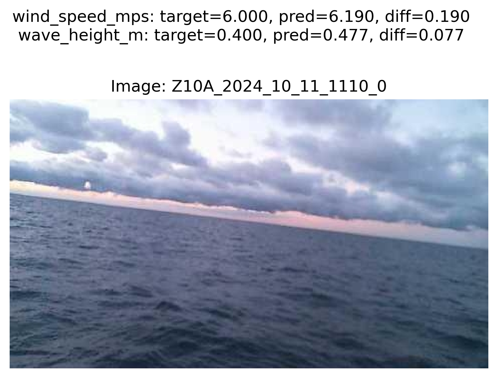</td>
<td>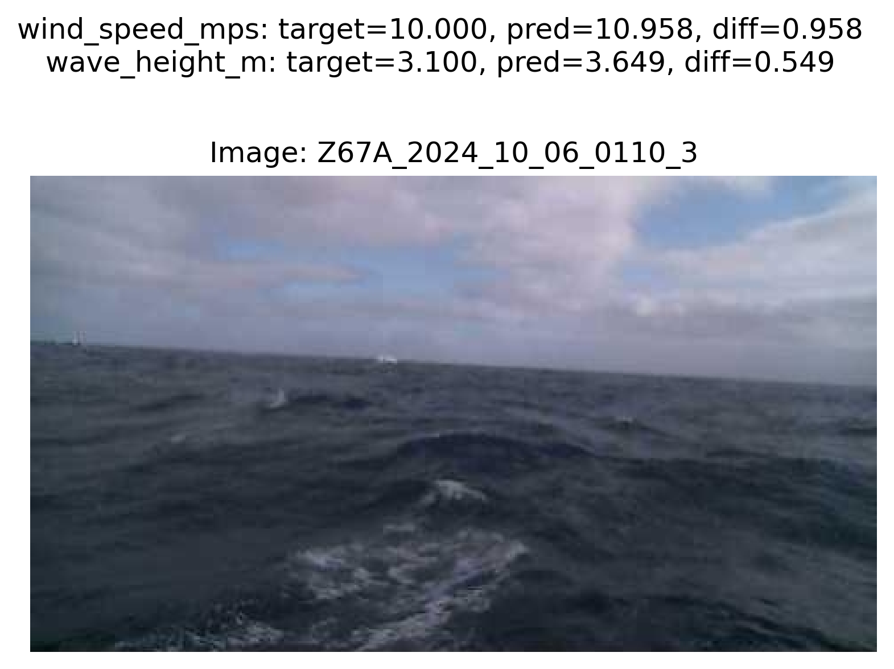</td>
</tr>
<tr>
<td>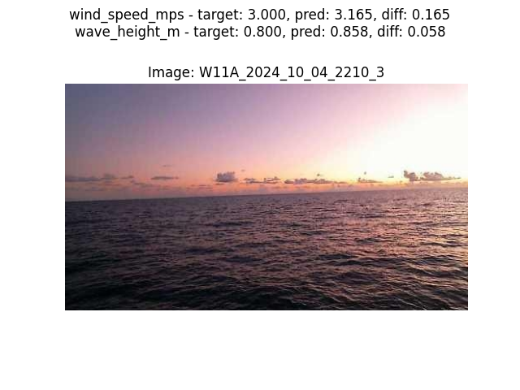</td>
<td>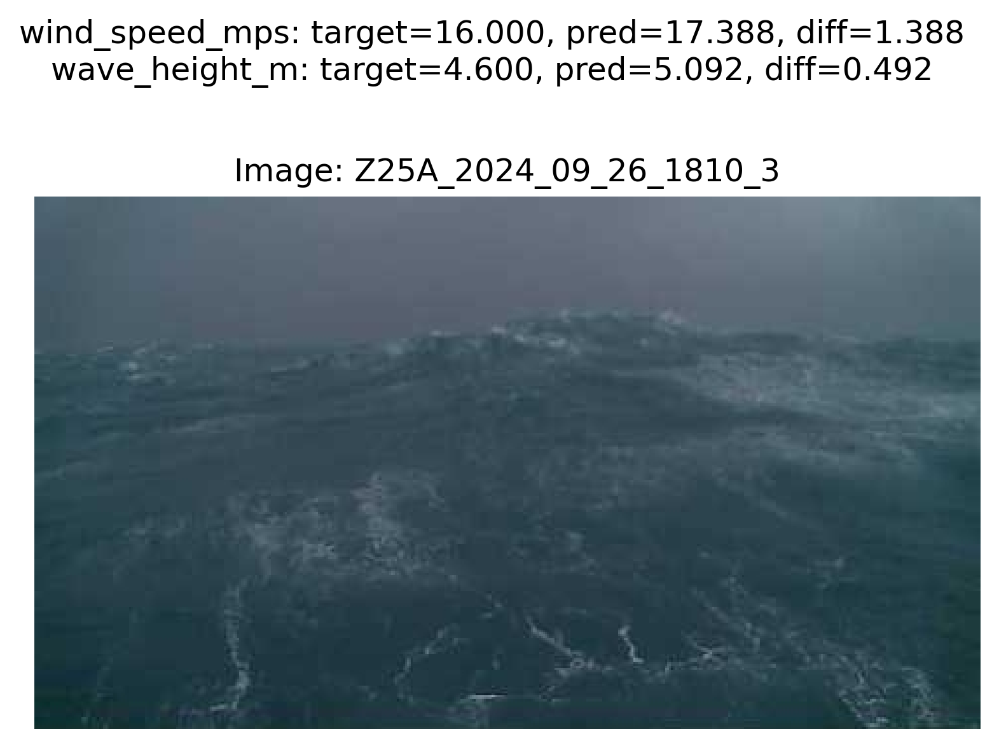</td>
</tr>
<tr>
<td>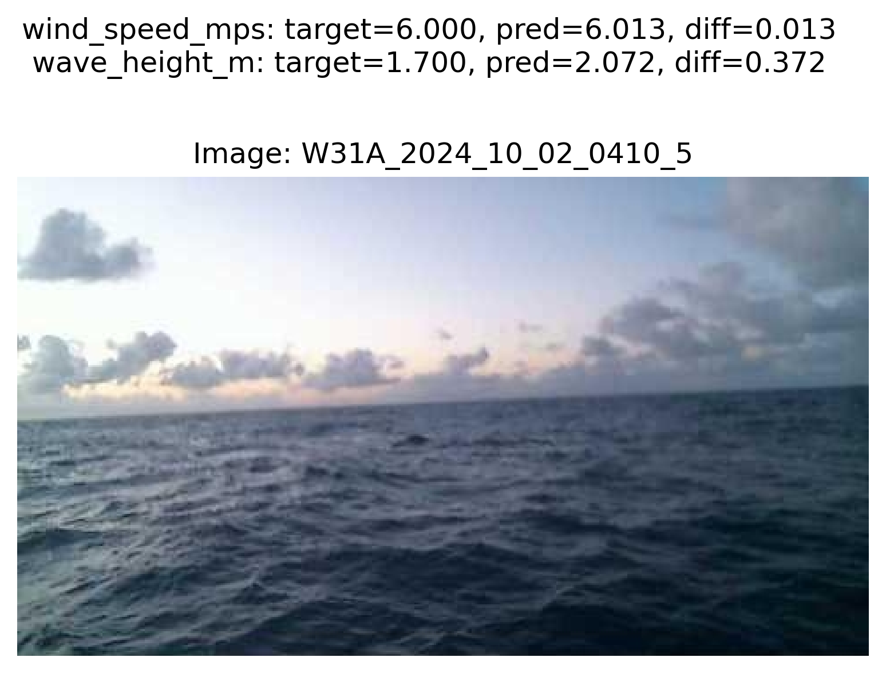</td>
<td>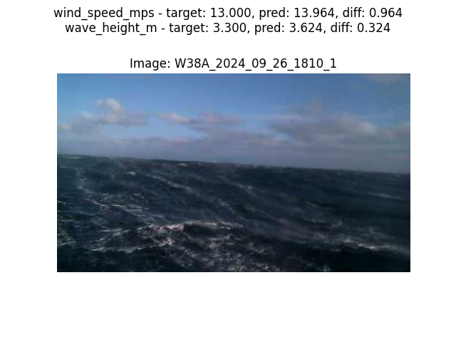</td>
</tr>
<tr>
<td>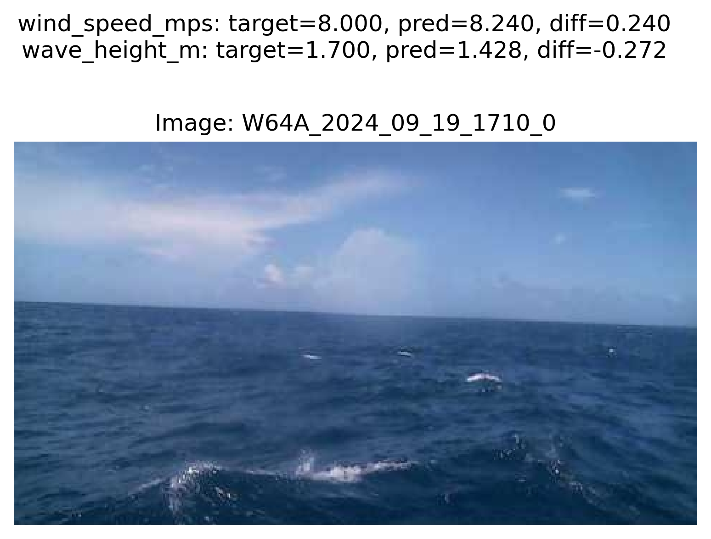</td>
<td>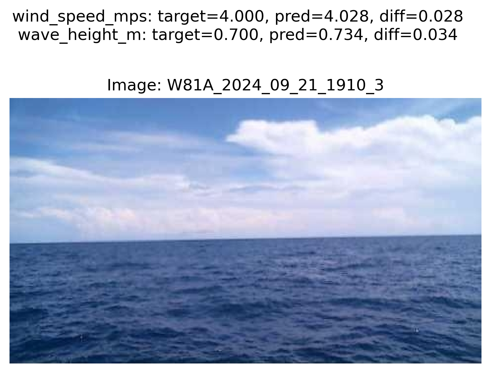</td>
</tr>
<tr>
<td>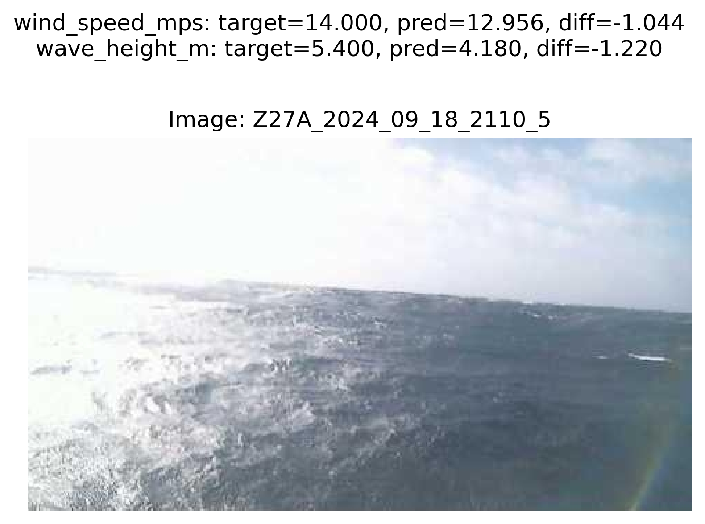</td>
<td>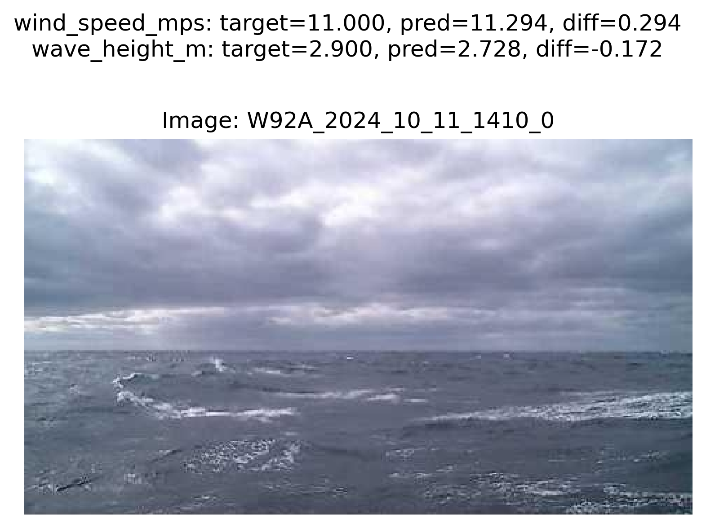</td>
</tr>
</table>

### Beaufort Scale Model

A simple model that predicts the Beaufort scale from an image of a sea. This uses a pretrained image classification model with 13 discrete outputs classes.

Beaufort scale is a scale of wind speed from 0 to 12.

| Beaufort Number | Description      | Wind Speed (m/s)  | Sea Conditions                                                              |
|-----------------|------------------|-------------------|----------------------------------------------------------------------------|
| 0               | Calm             | 0 - 0.5          | Sea surface smooth and mirror-like                                          |
| 1               | Light air        | 0.5 - 1.5        | Scaly ripples, no foam crests                                              |
| 2               | Light breeze     | 1.5 - 3.3        | Small wavelets, crests glassy, not breaking                                |
| 3               | Gentle breeze    | 3.3 - 5.5        | Large wavelets, crests begin to break, scattered whitecaps                 |
| 4               | Moderate breeze  | 5.5 - 7.9        | Small waves with breaking crests, fairly frequent whitecaps                |
| 5               | Fresh breeze     | 7.9 - 10.7       | Moderate waves of some length, many whitecaps, some spray                  |
| 6               | Strong breeze    | 10.7 - 13.8      | Long waves begin to form, white foam crests, some airborne spray          |
| 7               | Near gale        | 13.8 - 17.1      | Sea heaps up, foam begins to streak, spindrift begins                      |
| 8               | Gale            | 17.1 - 20.7       | Moderately high waves, crests break into spindrift                         |
| 9               | Strong gale      | 20.7 - 24.4      | High waves, dense foam, visibility affected                                |
| 10              | Storm            | 24.4 - 28.4      | Very high waves, heavy sea roll, visibility reduced                        |
| 11              | Violent storm    | 28.4 - 32.6      | Exceptionally high waves, sea completely white with foam and spray         |
| 12              | Hurricane force  | > 32.6           | Air filled with foam, sea white with driving spray, visibility greatly reduced |

Current best results on the test data split are:  

- Accuracy: 70%

Confusion matrix:

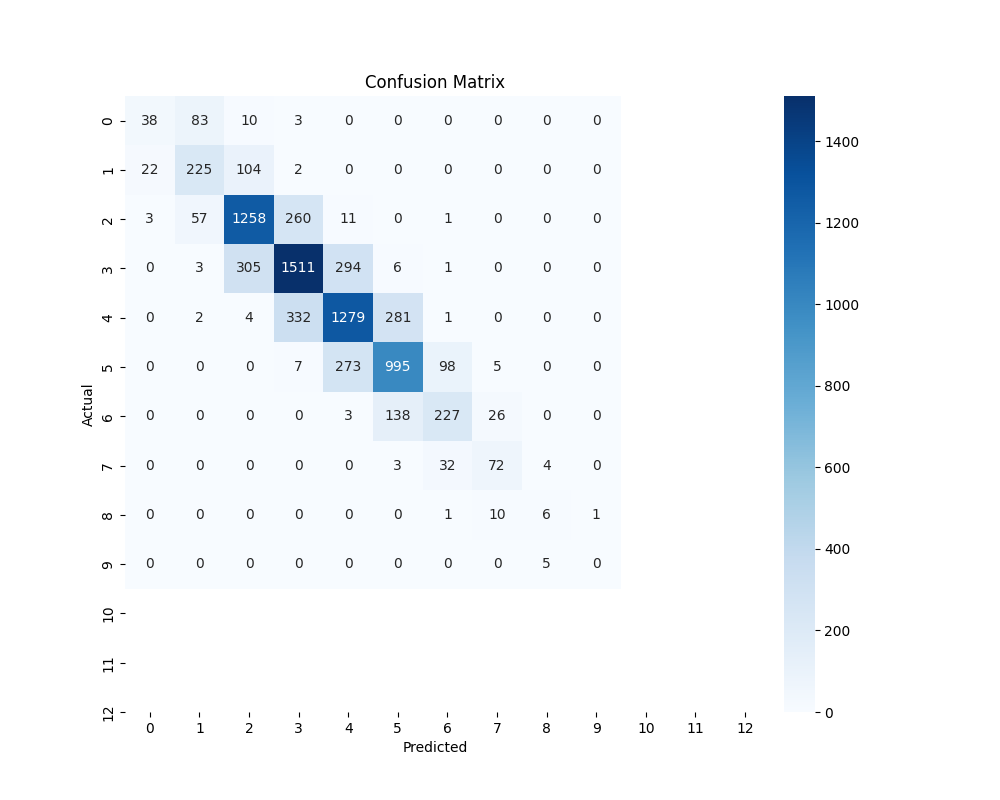

These results were achieved with the following training script input:

```
python -m seesea.model.beaufort.train --log DEBUG --input /Volumes/external/NOAA_buoycams --output /Volumes/external/seesea/train/beaufort --batch-size 64 --model "microsoft/swin-tiny-patch4-window7-224" --epochs 30 --learning-rate 0.001 --rotation 12
```

Current best known hyperperameters:
- Backbone pretrained image classification model: Swin-Tiny-Patch4-Window7-224
- Optimizer: AdamW
- Learning rate: scheduler type: linear, peak=0.001, warmup ratio:0.1
- Epochs: 30 (~30000 total training steps)
- Batch size: 64

#### Sample beaufort model output

<table>
<tr>
<td>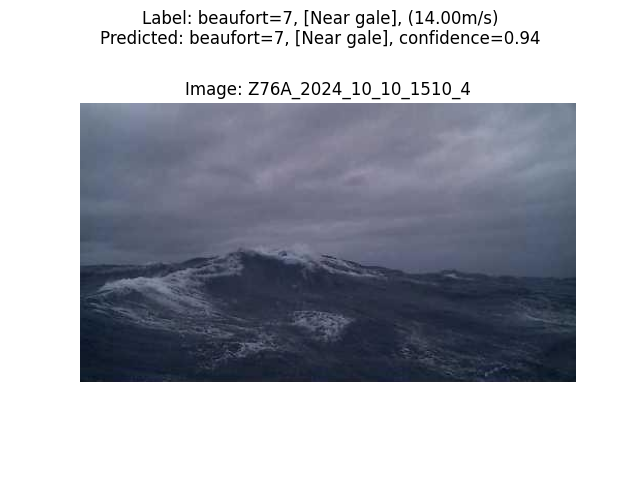</td>
<td>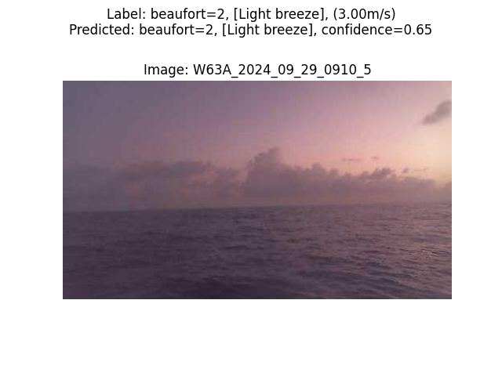</td>
</tr>
<tr>
<td>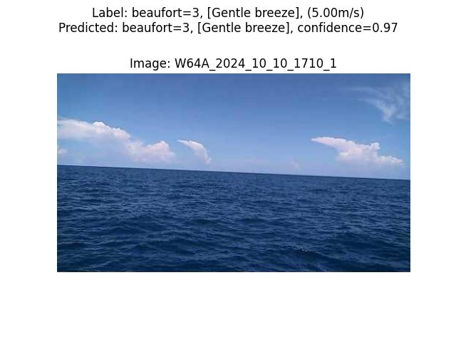</td>
<td>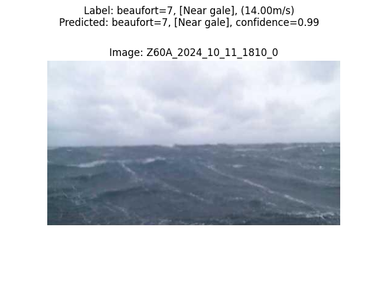</td>
</tr>
<tr>
<td>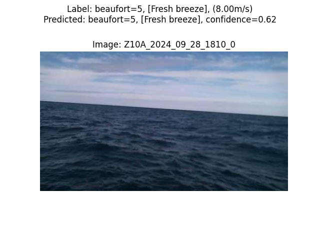</td>
<td>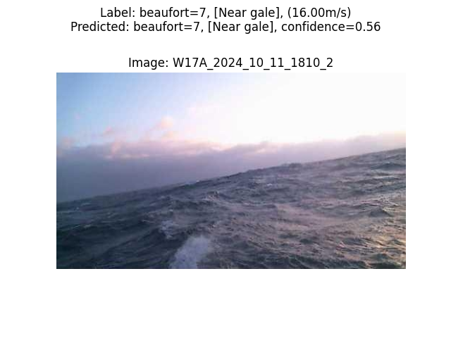</td>
</tr>
</table>

## Other potential data sources
Great Lakes Environmental Research Labs webcam images: 
- https://www.glerl.noaa.gov/metdata/

Other Great Lakes BuoyCams (images/video):
- https://limno.io/stations/

Regional Science Consortium of Presque Isle (large galary of buoy videos):
- https://wqdatalive.com/public/55

USGS Costal cameras:
- eg: https://cmgds.marine.usgs.gov/data/islaverde/

Live surf cameras:
- https://thesurfersview.com
- https://www.surfline.com 

Nova Scotia Webcams:
- https://www.novascotiawebcams.com
