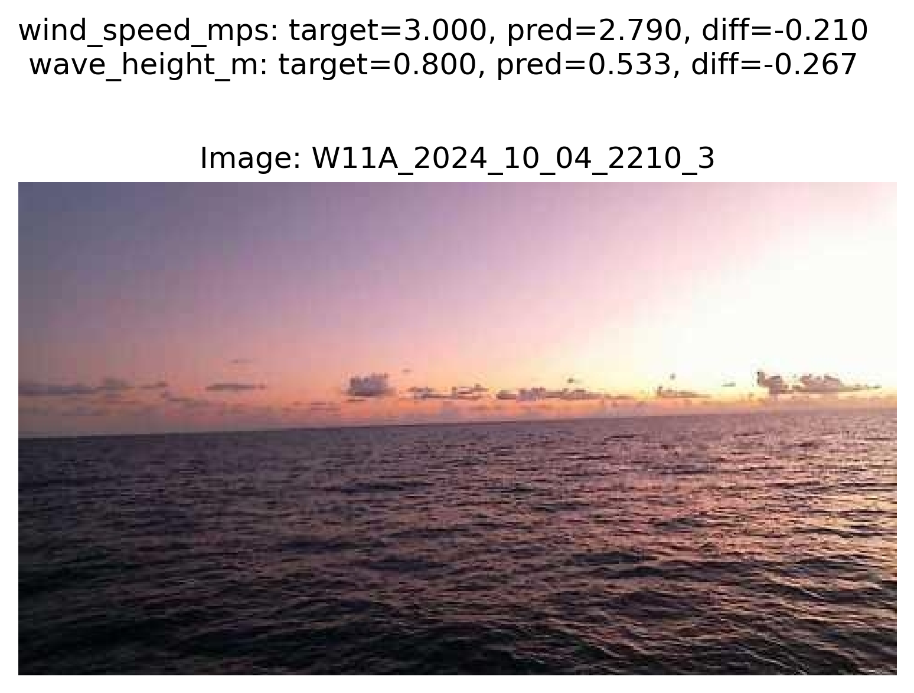
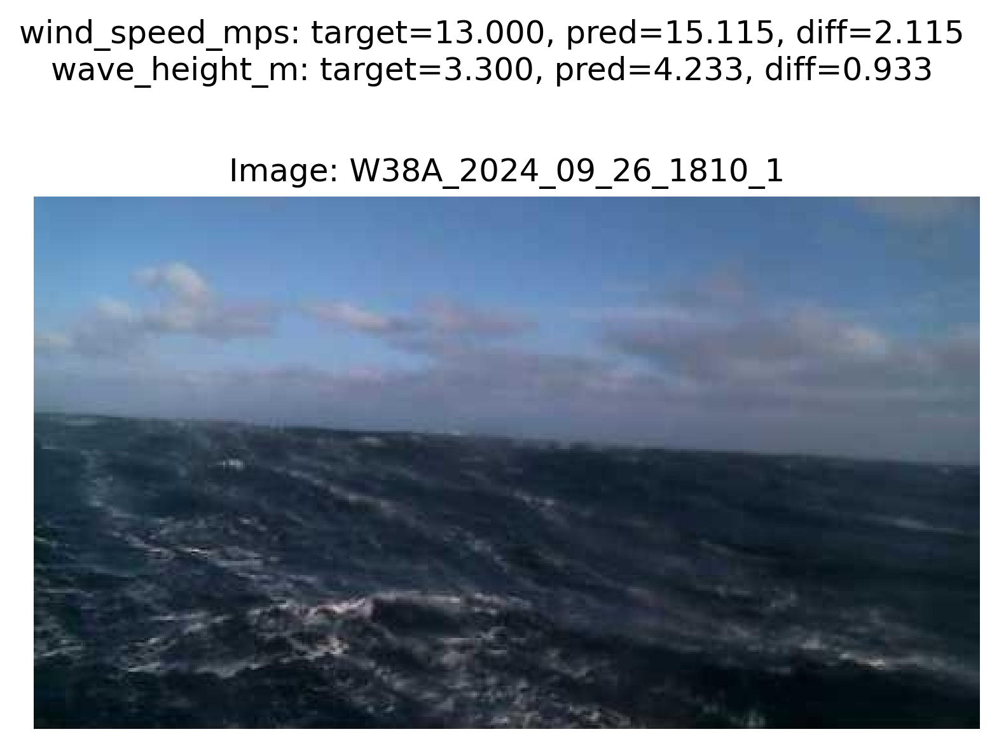

# SeeSea
A project that aims to **see** how much environmental information can be recovered from images of bodys of water (**seas**). For example: wind speed, wind direction, wave height, wave direction etc.

## Dataset
https://huggingface.co/datasets/brianofrim/NOAA_buoycams 

## Models

### Multihead Regression Model

A multiheaded regression model was chosen with an ouput head for each parameter we want to perdict. 

For the model backbone a pretrained image classification model is used with the final classification layer removed to expose it's input features. These features are then pooled and connected the the regression heads.

The output of each regression head is a continuous floating point value. Eg for wind speed the regression head ouput is the prediction in m/s.

Different pretrained image classification models were tested such a various sizes of ResNets and MobileVits.

Current best results on the test data split are:  

wind_speed_mps:
- Mean Absolute Error: 0.657 m/s

wave_height_m:
- Mean Absolute Error: 0.375 m

These results were achieved with the following training script input:
```
python -m seesea.model.multihead.train --log DEBUG --input /Volumes/external/NOAA_buoycams --output /Volumes/external/seesea/train --batch-size 64 --model "microsoft/swin-tiny-patch4-window7-224" --epochs 50 --learning-rate 0.0001 --output-names wind_speed_mps wave_height_m --rotation 12
```
Current best known hyperperameters:
- Backbone pretrained image classification model: swin-tiny-patch4-window7-224
- Optimizer: AdamW
- Learning rate: scheduler type: cosine annealing with warmup, peak=0.0001, warmup ratio:0.1
- Epochs: 50 (~50000 total training steps)
- Batch size: 64

#### Sample regression model output

<table>
<tr>
<td></td>
<td></td>
</tr>
<tr>
<td></td>
<td></td>
</tr>
<tr>
<td></td>
<td></td>
</tr>
<tr>
<td></td>
<td></td>
</tr>
<tr>
<td></td>
<td></td>
</tr>
</table>

## Other potential data sources
Great Lakes Environmental Research Labs webcam images: 
- https://www.glerl.noaa.gov/metdata/

Other Great Lakes BuoyCams (images/video):
- https://limno.io/stations/

Regional Science Consortium of Presque Isle (large galary of buoy videos):
- https://wqdatalive.com/public/55

USGS Costal cameras:
- eg: https://cmgds.marine.usgs.gov/data/islaverde/

Live surf cameras:
- https://thesurfersview.com
- https://www.surfline.com 

Nova Scotia Webcams:
- https://www.novascotiawebcams.com
